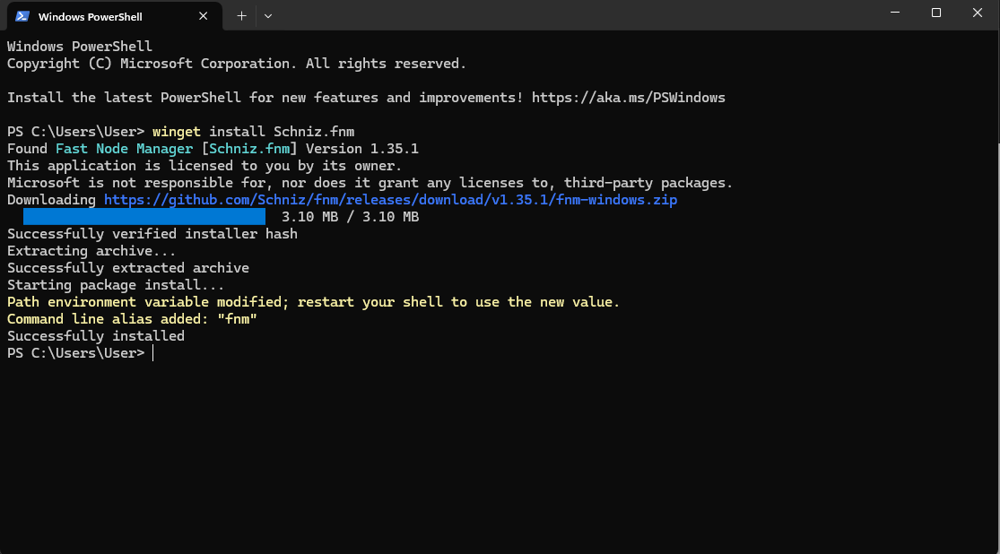
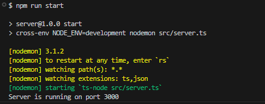

# Episodio 1: Introducción y Configuración del Entorno

En este episodio, configuraremos el entorno de desarrollo para nuestro proyecto de autenticación. Aprenderemos a instalar Node.js, TypeScript y otras dependencias necesarias.

## Pasos

1. **Instalación de Node.js y FNM**

   - **Para macOS/Linux:**
     - Instalar FNM a través de curl:
       ```bash
       curl -fsSL https://fnm.vercel.app/install | bash
       ```
     - Agrega lo siguiente a tu ~/.bashrc:
       ```bash
       eval "$(fnm env --use-on-cd)"
       ```
     - Reiniciar la terminal y luego instalar Node.js (LTS):
       ```bash
       fnm install --lts-latest
       fnm use --lts-latest
       ```
   - **Para Windows (utilizando la terminal PowerShell):**
     - Instalar FNM usando Winget:
       ```bash
       winget install Schniz.fnm
       ```
       
     - Luego de instalar FNM, abre PowerShell y ejecuta el siguiente comando para obtener la ruta del ejecutable de FNM:
       ```bash
       Get-Command fnm | Select-Object -ExpandProperty Source
       ```
     - Toma nota de la ruta del ejecutable de FNM (recuerda solo tomar la ruta que lleva al .exe). Por ejemplo, si te proporciona la siguiente ruta completa:
       ```
       C:\Users\User\AppData\Local\Microsoft\WinGet\Packages\Schniz.fnm_Microsoft.Winget.Source_8wekyb3d8bbwe\fnm.exe
       ```
       Entonces, la ruta que necesitas es:
       ```
       C:\Users\User\AppData\Local\Microsoft\WinGet\Packages\Schniz.fnm_Microsoft.Winget.Source_8wekyb3d8bbwe
       ```
       Es decir, debes omitir el nombre del archivo `fnm.exe` y tomar solo la ruta del directorio que contiene el ejecutable.
     - Ahora, debes agregar la ruta del ejecutable de FNM al PATH del sistema:
       - Haz clic con el botón derecho en "Este PC" o "Mi PC" en el Explorador de archivos y selecciona "Propiedades".
       - En el panel izquierdo, haz clic en "Configuración avanzada del sistema".
       - En la ventana de Propiedades del sistema, haz clic en el botón "Variables de entorno".
       - En la sección "Variables del sistema", selecciona la variable "Path" y haz clic en "Editar...".
       - Haz clic en "Nuevo" y pega la ruta del directorio que contiene el ejecutable de FNM (sin incluir el ".exe").
       - Haz clic en "Aceptar" para cerrar todas las ventanas.
     - Reinicia la computadora y luego instala Node.js (LTS) utilizando FNM:
       ```bash
       fnm install --lts-latest
       fnm use --lts-latest
       ```

2. **Configuración del Proyecto**

   - Dirigirse a la carpeta server/:
     ```bash
     cd server
     ```
   - Inicializar un nuevo proyecto Node.js:
     ```bash
     npm init -y
     ```

3. **Instalación de TypeScript y otras dependencias**

   - Instalar TypeScript y otras dependencias de desarrollo:
     ```bash
     npm install typescript ts-node @types/node @types/express cross-env nodemon --save-dev
     ```
   - Instalar las dependencias necesarias:
     ```bash
     npm install dotenv express
     ```
   - Crear el archivo de configuración de TypeScript:
     ```bash
     npx tsc --init
     ```

4. **Configuración Inicial de TypeScript**

   - Editar `tsconfig.json` para incluir las configuraciones básicas, ambas comentadas lo que hay que hacer es des-comentarlas y cambiarles el valor por los siguientes:

     ```json
     // tsconfig.json
     {
       "outDir": "./dist",
       "typeRoots": ["./node_modules/@types"]
     }
     ```

5. **Archivos de Configuración Adicionales**

   - Crear un archivo `.env.development` para almacenar las variables de entorno:

     ```
     PORT=3000
     SERVER_URL=http://localhost:3000
     ```

   - Crear un archivo `.env.temp` para los placeholders de las variables de entorno:

     ```
     PORT=3000
     SERVER_URL=http://localhost:3000
     ```

   - Crear un archivo `.gitignore` para excluir ciertos archivos y carpetas del repositorio:
     ```
     node_modules
     dist
     .env
     .env.development
     .env.production
     ```

6. **Scripts de NPM y cambio del main file en package.json**

   - Agrega los siguientes scripts en el archivo `package.json` para facilitar el desarrollo y la ejecución del proyecto:

     ```json
     "scripts": {
       "build": "cross-env NODE_ENV=production npx tsc",
       "start:js": "node dist/server.js",
       "start": "cross-env NODE_ENV=development nodemon src/server.ts",
       "test": "echo \"Error: no test specified\" && exit 1"
     }
     ```

   - Actualizar el main en el archivo `package.json` para correr el ejecutable:

     ```json
     "main": "dist/server.js",
     ```

7. **Archivos `server.ts` y `app.ts`**

   - Crear el archivo `src/server.ts` con el siguiente contenido:

     ```typescript
     import app from "./app";
     // Puerto
     const PORT = process.env.PORT || 3000;

     // Inicio del servidor
     app.listen(PORT, () => {
       console.log(`Server is running on port ${PORT}`);
     });
     ```

   - Crear el archivo `src/app.ts` con el siguiente contenido:

     ```typescript
     import express from "express";
     import dotenv from "dotenv";
     import path from "path";

     const app = express();

     // Middlewares
     // Configuración de variables de entorno
     dotenv.config({ path: path.resolve(__dirname, "..", `.env.${process.env.NODE_ENV}`) });

     export default app;
     ```

8. **Probar el servidor**

   - Ejecuta el comando `npm start` en la terminal:

     ```bash
     npm start
     ```

     

9. **Estructura de Carpetas**

   ```bash
     ├── server
     │   ├── src
     │   │   ├── app.ts
     │   │   └── server.ts
     │   ├── .env.development
     │   ├── .env.temp
     │   ├── .gitignore
     │   ├── package-lock.json
     │   ├── package.json
     │   └── tsconfig.json

   ```
