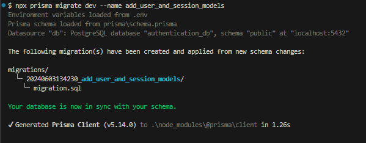

# Episodio 3: Definición de Modelos y Relaciones en Prisma

En este episodio, definiremos los modelos `User` y `Session` en nuestro esquema de Prisma y crearemos las relaciones necesarias entre ellos. También explicaremos la estructura del API de autenticación que vamos a implementar.

## Prerequisitos

- Completar los episodios anteriores:
  - [Episodio 1: Introducción y Configuración](./1-ep-intro-y-config.md)
  - [Episodio 2: Configuración de Prisma y PostgreSQL](./2-ep-config-prisma-postgresql.md)

## Modelo Mental del API de Autenticación

Nuestro sistema de autenticación incluirá los siguientes conceptos y relaciones:

- **User**: Representa a un usuario del sistema.
- **Session**: Representa una sesión de usuario, almacenando información sobre la sesión activa.

### Conceptos Clave

- **Usuarios (Users)**: Los usuarios tendrán atributos como `email`, `password`, `name`, etc.
- **Sesiones (Sessions)**: Las sesiones se asociarán a los usuarios y contendrán información como el token de sesión, la fecha de expiración, etc.

### Relaciones

- Un usuario puede tener múltiples sesiones (relación uno a muchos).

## Definición de los Modelos en Prisma

### 1. Editar el Prisma Schema

Vamos a editar el modelo `User` y crear el modelo `Session` en el archivo `schema.prisma`.

```prisma
model User {
  id        Int       @id @default(autoincrement())
  email     String    @unique
  password  String
  name      String?
  sessions  Session[]
  createdAt DateTime  @default(now())
  updatedAt DateTime  @updatedAt
}

model Session {
  id           Int       @id @default(autoincrement())
  userId       Int
  user         User      @relation(fields: [userId], references: [id])
  token        String    @unique
  expiresAt    DateTime
  createdAt    DateTime  @default(now())
}
```

### 2. Migrar el Esquema

Después de definir los modelos, necesitamos crear una nueva migración para aplicar estos cambios a la base de datos.

```bash
npx prisma migrate dev --name add_user_and_session_models
```

Si todo funciona correctamente, deberías recibir el siguiente mensaje en tu terminal:



3. **Estructura de Carpetas actualizada**

   ```bash
   server/
   ├── prisma/
   │   ├── migrations/
   │   │   │── 20240602173127_init/
   │   │   │     │    └── migration.sql
   │   │   │── 20240603134230_add_user_and_session_models/
   │   │   │     │    └── migration.sql
   │   │   └── migration_lock.toml
   │   └── schema.prisma
   ├── src/
   │   ├── config/
   │   │   └── prismaClient.ts
   │   ├── app.ts
   │   └── server.ts
   ├── .env
   ├── .env.temp
   ├── tsconfig.json
   └── .gitignore
   ```
