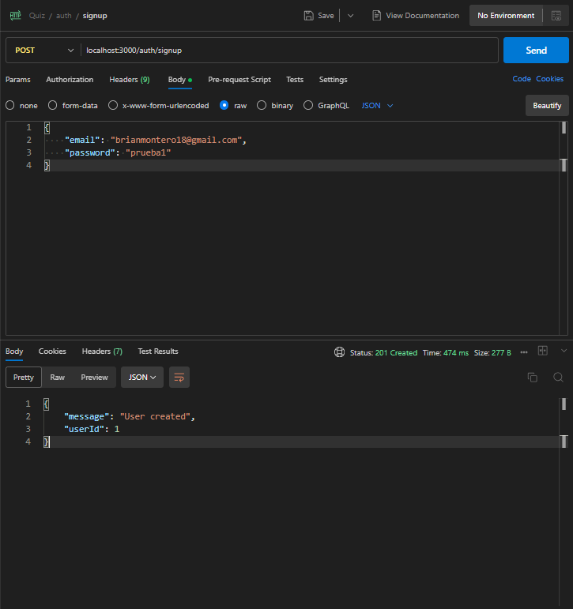
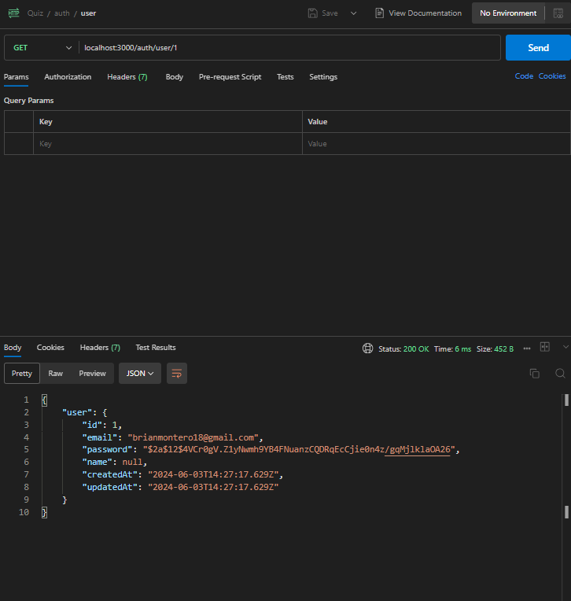
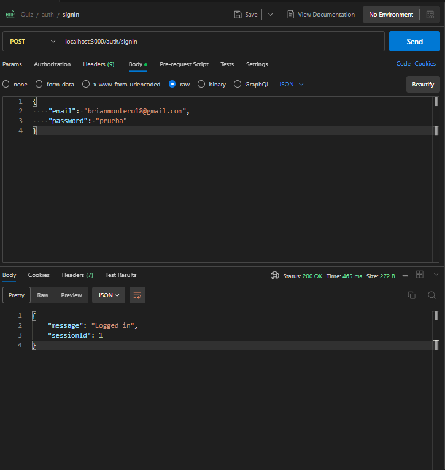
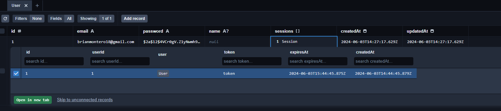
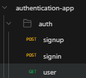

# Episodio 4: Creación de Endpoints de Autenticación

En este episodio, implementaremos los endpoints para nuestro sistema de autenticación. Nos enfocaremos en crear los controladores, servicios y rutas necesarios para manejar el registro de usuarios, inicio de sesión, cierre de sesión y la obtención de información del usuario autenticado.

## Prerequisitos

- Completar los episodios anteriores:
  - [Episodio 1: Introducción y Configuración](./1-ep-intro-y-config.md)
  - [Episodio 2: Configuración de Prisma y PostgreSQL](./2-ep-config-prisma-postgresql.md)
  - [Episodio 3: Definición de Modelos y Relaciones en Prisma](./3-ep-modelado-datos-prisma.md)

## Pasos

### 1. Instalación de Dependencias

```bash
npm install bcryptjs express-validator
```

Instalar los types de bcryptjs

```bash
npm install --save-dev @types/bcryptjs
```

- `express-validator` se usa para validar y sanitizar los datos de las solicitudes.
- `bcryptjs` se usa para hashear contraseñas antes de almacenarlas en la base de datos y para compararlas durante el inicio de sesión.

### 2. Creación del Servicio de Autenticación

El servicio de autenticación encapsulará la lógica de negocio para gestionar los usuarios.
Crear carpeta `src/services`, y dentro de ella crea un archivo `authService.ts`:

```typescript
import bcrypt from "bcryptjs";
import prisma from "../config/prismaClient";

export const createUser = async (email: string, password: string, name: string) => {
  const hashedPassword = await bcrypt.hash(password, 12);
  const user = await prisma.user.create({
    data: {
      email,
      password: hashedPassword,
      name,
    },
  });
  return user;
};

export const findUserByEmail = async (email: string) => {
  return prisma.user.findUnique({ where: { email } });
};

export const createSession = async (userId: number) => {
  const token = "token";
  const expiresAt = new Date();
  expiresAt.setHours(expiresAt.getHours() + 1); // La sesión expira en 1 hora

  const session = await prisma.session.create({
    data: {
      userId,
      token,
      expiresAt,
    },
  });
  return session;
};

export const getUserById = async (userId: number) => {
  return prisma.user.findUnique({ where: { id: userId } });
};
```

### 3. Creación del Controlador de Autenticación

Crear carpeta `src/controllers`, y dentro de ella crea un archivo `authController.ts`:

```typescript
import { Request, Response } from "express";
import { validationResult } from "express-validator";
import { createUser, findUserByEmail, createSession, getUserById } from "../services/authService";
import bcrypt from "bcryptjs";

export const postSignup = async (req: Request, res: Response) => {
  const errors = validationResult(req);
  if (!errors.isEmpty()) {
    return res.status(400).json({ errors: errors.array() });
  }

  const { email, password, name } = req.body;

  try {
    const user = await createUser(email, password, name);
    res.status(201).json({ message: "User created", userId: user.id });
  } catch (error) {
    res.status(500).json({ message: "Something went wrong" });
  }
};

export const postSignin = async (req: Request, res: Response) => {
  const errors = validationResult(req);
  if (!errors.isEmpty()) {
    return res.status(400).json({ errors: errors.array() });
  }

  const { email, password } = req.body;

  try {
    const user = await findUserByEmail(email);
    if (!user) {
      return res.status(401).json({ message: "Invalid credentials" });
    }

    const isMatch = await bcrypt.compare(password, user.password);
    if (!isMatch) {
      return res.status(401).json({ message: "Invalid credentials" });
    }

    const session = await createSession(user.id);

    res.status(200).json({ message: "Logged in", sessionId: session.id });
  } catch (error) {
    res.status(500).json({ message: "Something went wrong" });
  }
};

export const getUser = async (req: Request, res: Response) => {
  const userIdString = req.params.userId;
  const userId = parseInt(userIdString, 10); // Convertir el string a número

  if (isNaN(userId)) {
    // Si el userId no es un número válido, responder con un error 400 (Bad Request)
    return res.status(400).json({ message: "Invalid userId" });
  }

  try {
    const user = await getUserById(userId);
    if (!user) {
      return res.status(404).json({ message: "User not found" });
    }

    res.status(200).json({ user });
  } catch (error) {
    res.status(500).json({ message: "Something went wrong" });
  }
};
```

### 4. Creación del Enrutador de Autenticación

Crear carpeta `src/routes`, y dentro de ella crea un archivo `authRoute.ts`:

```typescript
import { Router } from "express";
import { check } from "express-validator";
import { postSignup, postSignin, getUser } from "../controllers/authController";

const router = Router();

router.post("/signup", [check("email").isEmail(), check("password").isLength({ min: 6 })], postSignup);
router.post("/signin", [check("email").isEmail(), check("password").exists()], postSignin);
router.get("/user/:userId", getUser);

export default router;
```

### 5. Actualización de `app.ts`

Actualiza el archivo `src/app.ts` para usar las nuevas rutas:

```typescript
import express from "express";
import authRoutes from "./routes/authRoute";

const app = express();

// Middlewares
app.use(express.json());

// Routes
app.use("/auth", authRoutes);

export default app;
```

### 6. Probar los Endpoints

Instala Postman como extension en tu VSCode

- Prueba de POST `/auth/signup`

  

- Prueba de GET `/auth/user/:userId`

  

- Prueba de POST `/auth/signin`

  

- Chequea luego en Prisma Studio que el usuario tiene una sesion asociada

  

- Estructura de carpetas en Postman:

  

### 7. Estructura de Carpetas actualizada

```bash
server/
├── prisma/
│   ├── migrations/
│   │   │── 20240602173127_init/
│   │   │     │    └── migration.sql
│   │   │── 20240603134230_add_user_and_session_models/
│   │   │     │    └── migration.sql
│   │   └── migration_lock.toml
│   └── schema.prisma
├── src/
│   ├── config/
│   │   └── prismaClient.ts
│   ├── controllers/
│   │   └── authController.ts
│   ├── routes/
│   │   └── authRoute.ts
│   ├── services/
│   │   ├── authService.ts
│   ├── app.ts
│   └── server.ts
├── .env
├── .env.temp
├── tsconfig.json
└── .gitignore
```
